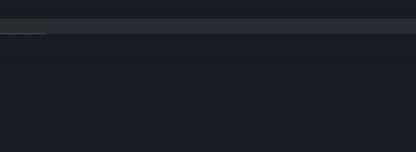

# Sublime - Odoo
## Snippets
Add some snippets for common code
- new model
- overwrite a model
- views (form, list, kanban, search, etc)
- common methods (create, write, etc)

Check the snippet folder to see what's available.

## Syntax highlighting
Syntax highlighting for QWeb templates, OWL templates and views.

Choose "XML - Odoo", and it will automatically choose the right syntax
- OWL syntax (with JS in expression) if inside `<templates/>`
- View syntax (with python in expression) if inside `<odoo/>`

It highlight JS template inside Python template (eg template of kanban views)

  

It also highlight mail templates and "backend" templates.

  

With this syntax highlighting comes the symbols, you can just to view / component template with `ctrl+r` / `ctrl+shift+r`

  

## Commands
Please install [fd-find](https://github.com/sharkdp/fd) and [ripgrep](https://github.com/BurntSushi/ripgrep) to use most of commands (they are use instead of slow python code to get the list of modules, list of models, etc)

> sudo apt install ripgrep fd-find

You can automatically create Python inherit, JS component, search a view and overwrite it, etc

  

Type "Odoo" in the command palette to see what's available.
> https://youtu.be/lkYhHB83vJ8

## Auto-complete

  

## TODO
- find a way to automatically change `__manifest__.py` without reformatting
- automatically insert the python import at the right place
